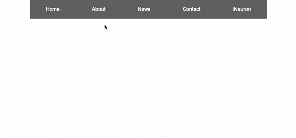

# CSS Challenges & Projects

## Articles

- CSS Position property: Deep dive into CSS position property & some pracital usage. [https://dhruvilxcode.hashnode.dev/deep-dive-into-css-position-some-practical-usage](https://dhruvilxcode.hashnode.dev/deep-dive-into-css-position-some-practical-usage)

- CSS Pseudo Elements and selectors: Easiest guide for using pseudo selectors and elements in CSS. [https://dhruvilxcode.hashnode.dev/easiest-guide-for-using-pseudo-selectors-and-elements-in-css](https://dhruvilxcode.hashnode.dev/easiest-guide-for-using-pseudo-selectors-and-elements-in-css)

## CSS Challenges
<table>
    <tr>
        <th>Challenge</th>
        <th>Source</th>
        <th>Image</th>
        <th>Live URL</th>
    </tr>
    <tr>
        <td>
            Button Challenge 1
        </td>
        <td>
            <a href="./css_challenges/ButtonChallenges/Challenge_1/">View Source</a>
        </td>
        <td>
            
        </td>
        <td>
            <a href="#">Open</a>
        </td>
    </tr>
    <tr>
        <td>
            Button Challenge 2
        </td>
        <td>
            <a href="./css_challenges/ButtonChallenges/Challenge_2/">View Source</a>
        </td>
        <td>
            
        </td>
        <td>
            <a href="#">Open</a>
        </td>
    </tr>
     <tr>
        <td>
            Button Challenge 3
        </td>
        <td>
            <a href="./css_challenges/ButtonChallenges/Challenge_3/">View Source</a>
        </td>
        <td>
            
        </td>
        <td>
            <a href="#">Open</a>
        </td>
    </tr>
    <tr>
        <td>
            Footer Challenge 1
        </td>
        <td>
            <a href="./css_challenges/Footer%20Section/Challenge_1/">View Source</a>
        </td>
        <td>
            
        </td>
        <td>
            <a href="#">Open</a>
        </td>
    </tr>
    <tr>
        <td>
            Footer Challenge 2
        </td>
        <td>
            <a href="./css_challenges/Footer%20Section/Challenge_2/">View Source</a>
        </td>
        <td>
            
        </td>
        <td>
            <a href="#">Open</a>
        </td>
    </tr>
    <tr>
        <td>
            Form Challenge 1
        </td>
        <td>
            <a href="./css_challenges/FormChallenges/Challenge_1/">View Source</a>
        </td>
        <td>
            
        </td>
        <td>
            <a href="#">Open</a>
        </td>
    </tr>
    <tr>
        <td>
            Form Challenge 2
        </td>
        <td>
            <a href="./css_challenges/FormChallenges/Challenge_2/">View Source</a>
        </td>
        <td>
            
        </td>
        <td>
            <a href="#">Open</a>
        </td>
    </tr>
    <tr>
        <td>
            Navbar Challenge 1
        </td>
        <td>
            <a href="./css_challenges/NavbarChallenges/Challenge_1/">View Source</a>
        </td>
        <td>
            
        </td>
        <td>
            <a href="#">Open</a>
        </td>
    </tr>
    <tr>
        <td>
            Navbar Challenge 2
        </td>
        <td>
            <a href="./css_challenges/NavbarChallenges/Challenge_2/">View Source</a>
        </td>
        <td>
            
        </td>
        <td>
            <a href="#">Open</a>
        </td>
    </tr>
    <tr>
        <td>
            Navbar Challenge 3
        </td>
        <td>
            <a href="./css_challenges/NavbarChallenges/Challenge_3/">View Source</a>
        </td>
        <td>
            
        </td>
        <td>
            <a href="#">Open</a>
        </td>
    </tr>
    <tr>
        <td>
            Table Challenge 1
        </td>
        <td>
            <a href="./css_challenges/TableChallenges/Challenge_1/">View Source</a>
        </td>
        <td>
            
        </td>
        <td>
            <a href="#">Open</a>
        </td>
    </tr>
    <tr>
        <td>
            Table Challenge 2
        </td>
        <td>
            <a href="./css_challenges/TableChallenges/Challenge_2/">View Source</a>
        </td>
        <td>
            
        </td>
        <td>
            <a href="#">Open</a>
        </td>
    </tr>
</table>

## Projects

