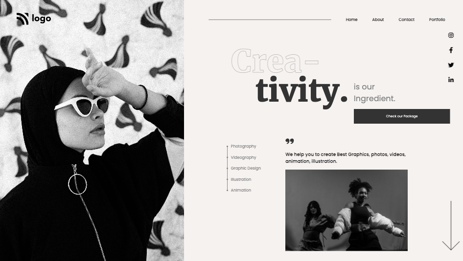

# Live Class Project 14

# Developer
[Dhruvil Patel](https://github.com/dhruvilxcode)

# My Learnings
In Project 14, this was different design to implement, but done with `position: fixed`, with the flow it became easy to code and design, learnt new CSS property to give stoke to Text `-webkit-text-stroke-width: 1px`, `-webkit-text-stroke-color: #888;`. Enjoyed this project, it was quite challenging, but yes, without challenge we can't learn :)

# Completion Time
3 Hour

# Live Preview
[https://css-projects-dhruvil.netlify.app/projects/live-class-project-14](https://css-projects-dhruvil.netlify.app/projects/live-class-project-14)

# Screenshot
